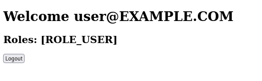

= Kerberos Demo

This demo shows a working example of a Spring application secured with Kerberos.
The goal is to provide a starting point for developers with a Linux system that don't have an Active Directory up and running.
So the project includes a Dockerfile for a KDC you can test with.
Clients can either authenticate with a SPNEGO token or provide their username and password.

== Configuration Overview

|===
|Realm        | EXAMPLE.COM
|KDC Hostname | kerberos.example.com
|App Hostname | app.example.com
|Username     | user
|Password     | secret
|===

== Step-by-step instructions

=== DNS Records:

Add the KDC and application hostname at `/etc/hosts`.

```
127.0.0.1	kerberos.example.com
127.0.0.1	app.example.com
```

=== Kerberos Configuration

Adjust your Kerberos configuration at `/etc/krb5.conf`.

```
[libdefaults]
default_realm = EXAMPLE.COM
...

[realms]
EXAMPLE.COM = {
    kdc = kerberos.example.com
    admin_server = kerberos.example.com
}

[domain_realm]
.example.com = EXAMPLE.COM
example.com = EXAMPLE.COM
```

=== KDC Docker Container

Start the local KDC server and copy the generated keytab file for the application.

```
$ docker build -t kdc-image src/main/docker
$ docker run --name=kdc -d -p 749:749/tcp -p 88:88/udp kdc-image
$ docker logs kerberos
$ docker cp kdc:/app.keytab src/main/resources/app.keytab
```

=== Application

Start the application.

```
$ ./gradlew bootRun
```

=== Command Line Kerberos Client

Initialize kerberos and perform a test.

```
$ kinit user
Passwort für user@EXAMPLE.COM:

$ curl -v -u : --negotiate app.example.com:8080
*   Trying 127.0.0.1:8080...
* Connected to app.example.com (127.0.0.1) port 8080 (#0)
* Server auth using Negotiate with user ''
> GET / HTTP/1.1
> Host: app.example.com:8080
> Authorization: Negotiate YIICkQYGKwYBBQUCoIIChTCCAoGgDTALBgkqhkiG9xIBAgKiggJuBIICamCCAmYGCSqGSIb3EgECAgEAboICVTCCAlGgAwIBBaEDAgEOogcDBQAgAAAAo4IBamGCAWYwggFioAMCAQWhDRsLRVhBTVBMRS5DT02iIjAgoAMCAQOhGTAXGwRIVFRQGw9hcHAuZXhhbXBsZS5jb22jggEmMIIBIqADAgESoQMCAQKiggEUBIIBEB29pTsPd+mYdTHImpDowvlBzvve2ydxkKJe3G1gEu725RMY5Co7ure6Khqo9RO2jQVLuGrsGbKyKa0FrcM8ye3g6hweKjmza9FveWdce6j49OsCAQvIBjAB2g5gzxSYnpl4bftKTqNbCzFPWEMHb/MIU2rOy1q5jigjnBXgpQUHvSYI7IORXr5g+rgf7CSxFPQy1DWieZjn4eIPdZ5siVvmzVRTYUsrUfG/hcnV80qricOcWeMfOzXi4WiUmPpfcv+W1+GYI/5fxyc5G9D7jaH5o71LPDCDDPNSh+2Gun1IX3piv2AtdNkzPfCBE8VAq9cEAifiBPcYaKpC8fUxo/8my9He93ecu/78S1QUiUrgpIHNMIHKoAMCARKigcIEgb/nvVajLdRROXlV8vUYlCS42W7JmrUpB/EDTf8UJ2/32oUzWyGSpCdgY/K0YoqH/nRmwBcmUYvtPgJ+OhT1bQ4/KFLGsavZgTzgbKuNUKMXMe8+7LKErqQKNsWWPZc8W9zKHysldaZWICQfUZrLSJ1+MyzbOlhuHP7bBm0sW03ndHdTY1OIiMB9Z68TLFB5Q6mEO29fVMLg6rj3XThnrWqOhFR+ZpcG7/vJjlC03+IXE04w4GsrYOL0GFCPWGn8nA==
> User-Agent: curl/7.79.1
> Accept: */*
>
* Mark bundle as not supporting multiuse
< HTTP/1.1 200
< Set-Cookie: JSESSIONID=4F72DE5F458F7DAF70FB8D2044DC518A; Path=/; HttpOnly
< X-Content-Type-Options: nosniff
< X-XSS-Protection: 1; mode=block
< Cache-Control: no-cache, no-store, max-age=0, must-revalidate
< Pragma: no-cache
< Expires: 0
< X-Frame-Options: DENY
< Content-Type: text/html;charset=UTF-8
< Content-Language: de-DE
< Transfer-Encoding: chunked
< Date: Wed, 22 Dec 2021 13:25:09 GMT
<
<!DOCTYPE html>
<html lang="en">
<head>
  <meta charset="UTF-8">
  <title>Welcome</title>
</head>
<body>

<h1>Welcome <span>user@EXAMPLE.COM</span></h1>
<h2>Roles: <span>[ROLE_USER]</span></h2>

<form action="/logout" method="post"><input type="hidden" name="_csrf" value="e5f8a6c8-d02d-4d20-a019-6d20b79c1851"/>
  <input type="submit" value="Logout"/>
</form>

</body>
</html>
* Connection #0 to host app.example.com left intact
```

=== Web Browser

The form login can be accessed at http://localhost:8080.


After the login you are greeted with your user details.


